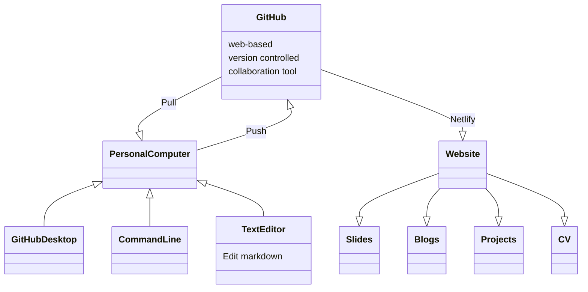

[![](https://mermaid.ink/img/eyJjb2RlIjoiZXJEaWFncmFtXG4gICAgUkFBUE9JLU1BU1RFUiB9fC4ufHsgUVVJQ0tURVNUIDogQ09ERV9URVNUSU5HX0pPQlNcbiAgICBRVUlDS1RFU1R7XG4gICAgICAgIElUTDA0bjAxIFxuICAgICAgICBJVEwwNG4wMlxuICAgICAgICBJVEwwNG4wMyBcbiAgICAgICAgSVRMMDRuMDRcbiAgICB9XG4gICAgUVVJQ0tURVNUIHx8LS1veyBRVUlDS1RFU1RfSU5GTyA6IE5PVEVTXG4gICAgUVVJQ0tURVNUX0lORk97XG4gICAgbWF4UnVudGltZSBmaXZlSG91cnNcbiAgICBQdXJwb3NlIHRlc3RTbWFsbEpvYnNcbiAgICBJUC1SYW5nZSAgRm91cnR5Rm91cl9Gb3VydHlTZXZlblxuICAgIH1cbiAgICBSQUFQT0ktTUFTVEVSIH18Li58eyBCSUdfTUVNIDogSElHSF9NRU1PUllfSk9CU1xuICAgIEJJR19NRU17XG4gICAgICAgIEhJR0gwMVxuICAgICAgICBISUdIMDJcbiAgICAgICAgSElHSDAzICAgIFxuICAgICAgICBISUdIMDRcbiAgICAgICAgSElHSDA1XG4gICAgICAgIEhJR0gwNlxuICAgIH1cbiAgICBCSUdfTUVNIHx8LS1veyBCSUdfTUVNX0lORk8gOiBOT1RFU1xuICAgIEJJR19NRU1fSU5GT3tcbiAgICBtYXhSdW50aW1lIHRlbkRheXNcbiAgICBQdXJwb3NlIGhpZ2hNZW1vcnlKb2JzXG4gICAgfVxuICAgIFJBQVBPSS1NQVNURVIgfXwuLnx7IFBBUkFMTEVMIDogR0VORVJBTF9QVVJQT1NFX0pPQlNcbiAgICBQQVJBTExFTHtcbiAgICAgICAgU1BKMDFcbiAgICAgICAgSVRMMDFuMDEtNFxuICAgICAgICBJVEwwMm4wMi00XG4gICAgICAgIElUTDAzbjAzLTRcbiAgICAgICAgQU1EMDFuMDEtNFxuICAgICAgICBBTUQwMm4wMS00XG4gICAgICAgIEFNRDAzbjAxLTRcbiAgICAgICAgQU1EMDRuMDEtNFxuICAgICAgICBBTUQwNW4wMS00XG4gICAgICAgIEFNRDA2bjAxLTRcbiAgICAgICAgR1BVMDFcbiAgICAgICAgR1BVMDIgICAgXG4gICAgfVxuICAgIFBBUkFMTEVMIHx8LS1veyBQQVJBTExFTF9JTkZPIDogTk9URVNcbiAgICBQQVJBTExFTF9JTkZPe1xuICAgIG1heFJ1bnRpbWUgdGVuRGF5c1xuICAgIFB1cnBvc2UgZ2VuZXJhbFB1cnBvc2VKb2JzXG4gICAgU1BKIHNwYWNlSmFtXG4gICAgSVRMIEludGVsX25vZGVcbiAgICBBTUQgQU1EX25vZGVcbiAgICBHUFUgZ3JhcGhpY3NOb2RlXG4gICAgfVxuICAgIFJBQVBPSS1NQVNURVIgfXwuLnx7IFNUT1JBR0UgOiBTVE9SQUdFXG4gICAgU1RPUkFHRXtcbiAgICAgICAgQkVFMDEgXG4gICAgICAgIEJFRTAyXG4gICAgICAgIEJFRTAzXG4gICAgICAgIFJBQVBPSV9GUzAxXG4gICAgfVxuICAgIFNUT1JBR0UgfHwtLW97IFNUT1JBR0VfSU5GTyA6IE5PVEVTXG4gICAgU1RPUkFHRV9JTkZPe1xuICAgIEJFRSBiZWVYX2NsdXN0ZXJcbiAgICBGUyBmYXN0U3RvcmFnZVxuICAgIEZTX1NpemUgVHdvX3hfNTBUZXJyYWJ5dGVzIFxuICAgIH1cbiAgICBSQUFQT0ktTUFTVEVSIH18Li58eyBVVElMSVRZIDogREFUQV9UUkFOU0ZFUlxuICAgIFVUSUxJVFl7XG4gICAgICAgIERUbjAxXG4gICAgICAgIERIQ1BfUFhFXG4gICAgfVxuICAgIFVUSUxJVFkgfHwtLW97IFVUSUxJVFlfSU5GTyA6IE5PVEVTXG4gICAgVVRJTElUWV9JTkZPe1xuICAgIERUbjAxIGRhdGFUcmFuc2Zlck5vZGVcbiAgICBQdXJwb3NlIHRyYW5zZmVyTGFyZ2VGaWxlc1RvU2NyYXRjaFN0b3JhZ2VcbiAgICBEQ0hQIElQX0FsbG9jYXRpb25cbiAgICBEQ0hQX05vdGVzIHN0YXRpY0Jhc2VkT25NQUNBZGRyZXNzXG4gICAgTG9jYXRpb24gVkxBTl8xOTAxXG4gICAgfSIsIm1lcm1haWQiOnsidGhlbWUiOiJmb3Jlc3QifSwidXBkYXRlRWRpdG9yIjpmYWxzZSwiYXV0b1N5bmMiOmZhbHNlLCJ1cGRhdGVEaWFncmFtIjpmYWxzZX0)](https://mermaid-js.github.io/mermaid-live-editor/edit##eyJjb2RlIjoiZXJEaWFncmFtXG4gICAgUkFBUE9JLU1BU1RFUiB9fC4ufHsgUVVJQ0tURVNUIDogQ09ERV9URVNUSU5HX0pPQlNcbiAgICBRVUlDS1RFU1R7XG4gICAgICAgIElUTDA0bjAxIFxuICAgICAgICBJVEwwNG4wMlxuICAgICAgICBJVEwwNG4wMyBcbiAgICAgICAgSVRMMDRuMDRcbiAgICB9XG4gICAgUVVJQ0tURVNUIHx8LS1veyBRVUlDS1RFU1RfSU5GTyA6IE5PVEVTXG4gICAgUVVJQ0tURVNUX0lORk97XG4gICAgbWF4UnVudGltZSBmaXZlSG91cnNcbiAgICBQdXJwb3NlIHRlc3RTbWFsbEpvYnNcbiAgICBJUC1SYW5nZSAgRm91cnR5Rm91cl9Gb3VydHlTZXZlblxuICAgIH1cbiAgICBSQUFQT0ktTUFTVEVSIH18Li58eyBCSUdfTUVNIDogSElHSF9NRU1PUllfSk9CU1xuICAgIEJJR19NRU17XG4gICAgICAgIEhJR0gwMVxuICAgICAgICBISUdIMDJcbiAgICAgICAgSElHSDAzICAgIFxuICAgICAgICBISUdIMDRcbiAgICAgICAgSElHSDA1XG4gICAgICAgIEhJR0gwNlxuICAgIH1cbiAgICBCSUdfTUVNIHx8LS1veyBCSUdfTUVNX0lORk8gOiBOT1RFU1xuICAgIEJJR19NRU1fSU5GT3tcbiAgICBtYXhSdW50aW1lIHRlbkRheXNcbiAgICBQdXJwb3NlIGhpZ2hNZW1vcnlKb2JzXG4gICAgfVxuICAgIFJBQVBPSS1NQVNURVIgfXwuLnx7IFBBUkFMTEVMIDogR0VORVJBTF9QVVJQT1NFX0pPQlNcbiAgICBQQVJBTExFTHtcbiAgICAgICAgU1BKMDFcbiAgICAgICAgSVRMMDFuMDEtNFxuICAgICAgICBJVEwwMm4wMi00XG4gICAgICAgIElUTDAzbjAzLTRcbiAgICAgICAgQU1EMDFuMDEtNFxuICAgICAgICBBTUQwMm4wMS00XG4gICAgICAgIEFNRDAzbjAxLTRcbiAgICAgICAgQU1EMDRuMDEtNFxuICAgICAgICBBTUQwNW4wMS00XG4gICAgICAgIEFNRDA2bjAxLTRcbiAgICAgICAgR1BVMDFcbiAgICAgICAgR1BVMDIgICAgXG4gICAgfVxuICAgIFBBUkFMTEVMIHx8LS1veyBQQVJBTExFTF9JTkZPIDogTk9URVNcbiAgICBQQVJBTExFTF9JTkZPe1xuICAgIG1heFJ1bnRpbWUgdGVuRGF5c1xuICAgIFB1cnBvc2UgZ2VuZXJhbFB1cnBvc2VKb2JzXG4gICAgU1BKIHNwYWNlSmFtXG4gICAgSVRMIEludGVsX25vZGVcbiAgICBBTUQgQU1EX25vZGVcbiAgICBHUFUgZ3JhcGhpY3NOb2RlXG4gICAgfVxuICAgIFJBQVBPSS1NQVNURVIgfXwuLnx7IFNUT1JBR0UgOiBTVE9SQUdFXG4gICAgU1RPUkFHRXtcbiAgICAgICAgQkVFMDEgXG4gICAgICAgIEJFRTAyXG4gICAgICAgIEJFRTAzXG4gICAgICAgIFJBQVBPSV9GUzAxXG4gICAgfVxuICAgIFNUT1JBR0UgfHwtLW97IFNUT1JBR0VfSU5GTyA6IE5PVEVTXG4gICAgU1RPUkFHRV9JTkZPe1xuICAgIEJFRSBiZWVYX2NsdXN0ZXJcbiAgICBGUyBmYXN0U3RvcmFnZVxuICAgIEZTX1NpemUgVHdvX3hfNTBUZXJyYWJ5dGVzIFxuICAgIH1cbiAgICBSQUFQT0ktTUFTVEVSIH18Li58eyBVVElMSVRZIDogREFUQV9UUkFOU0ZFUlxuICAgIFVUSUxJVFl7XG4gICAgICAgIERUbjAxXG4gICAgICAgIERIQ1BfUFhFXG4gICAgfVxuICAgIFVUSUxJVFkgfHwtLW97IFVUSUxJVFlfSU5GTyA6IE5PVEVTXG4gICAgVVRJTElUWV9JTkZPe1xuICAgIERUbjAxIGRhdGFUcmFuc2Zlck5vZGVcbiAgICBQdXJwb3NlIHRyYW5zZmVyTGFyZ2VGaWxlc1RvU2NyYXRjaFN0b3JhZ2VcbiAgICBEQ0hQIElQX0FsbG9jYXRpb25cbiAgICBEQ0hQX05vdGVzIHN0YXRpY0Jhc2VkT25NQUNBZGRyZXNzXG4gICAgTG9jYXRpb24gVkxBTl8xOTAxXG4gICAgfSIsIm1lcm1haWQiOiJ7XG4gIFwidGhlbWVcIjogXCJmb3Jlc3RcIlxufSIsInVwZGF0ZUVkaXRvciI6dHJ1ZSwiYXV0b1N5bmMiOmZhbHNlLCJ1cGRhdGVEaWFncmFtIjpmYWxzZX0)


```mermaid
erDiagram
    RAAPOI-MASTER }|..|{ QUICKTEST : CODE_TESTING_JOBS
    QUICKTEST{
        ITL04n01 
        ITL04n02
        ITL04n03 
        ITL04n04
    }
    QUICKTEST ||--o{ QUICKTEST_INFO : NOTES
    QUICKTEST_INFO{
    maxRuntime fiveHours
    Purpose testSmallJobs
    IP-Range  FourtyFour_FourtySeven
    }
    RAAPOI-MASTER }|..|{ BIG_MEM : HIGH_MEMORY_JOBS
    BIG_MEM{
        HIGH01
        HIGH02
        HIGH03    
        HIGH04
        HIGH05
        HIGH06
    }
    BIG_MEM ||--o{ BIG_MEM_INFO : NOTES
    BIG_MEM_INFO{
    maxRuntime tenDays
    Purpose highMemoryJobs
    }
    RAAPOI-MASTER }|..|{ PARALLEL : GENERAL_PURPOSE_JOBS
    PARALLEL{
        SPJ01
        ITL01n01-4
        ITL02n02-4
        ITL03n03-4
        AMD01n01-4
        AMD02n01-4
        AMD03n01-4
        AMD04n01-4
        AMD05n01-4
        AMD06n01-4
        GPU01
        GPU02    
    }
    PARALLEL ||--o{ PARALLEL_INFO : NOTES
    PARALLEL_INFO{
    maxRuntime tenDays
    Purpose generalPurposeJobs
    SPJ spaceJam
    ITL Intel_node
    AMD AMD_node
    GPU graphicsNode
    }
    RAAPOI-MASTER }|..|{ STORAGE : STORAGE
    STORAGE{
        BEE01 
        BEE02
        BEE03
        RAAPOI_FS01
    }
    STORAGE ||--o{ STORAGE_INFO : NOTES
    STORAGE_INFO{
    BEE beeX_cluster
    FS fastStorage
    FS_Size Two_x_50Terrabytes 
    }
    RAAPOI-MASTER }|..|{ UTILITY : DATA_TRANSFER
    UTILITY{
        DTn01
        DHCP_PXE
    }
    UTILITY ||--o{ UTILITY_INFO : NOTES
    UTILITY_INFO{
    DTn01 dataTransferNode
    Purpose transferLargeFilesToScratchStorage
    DCHP IP_Allocation
    DCHP_Notes staticBasedOnMACAddress
    Location VLAN_1901
    }
    ```