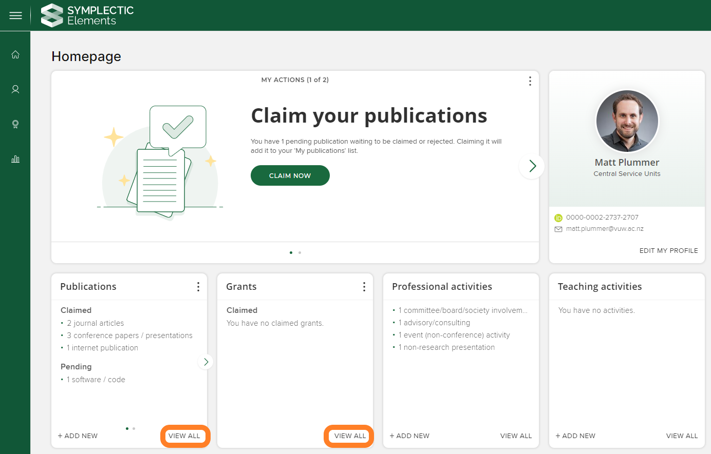
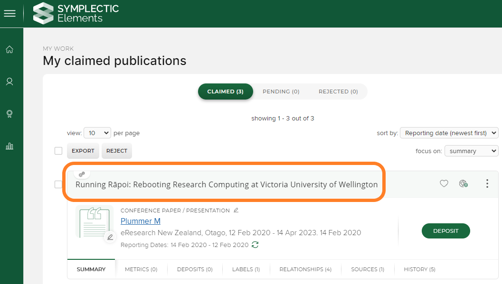
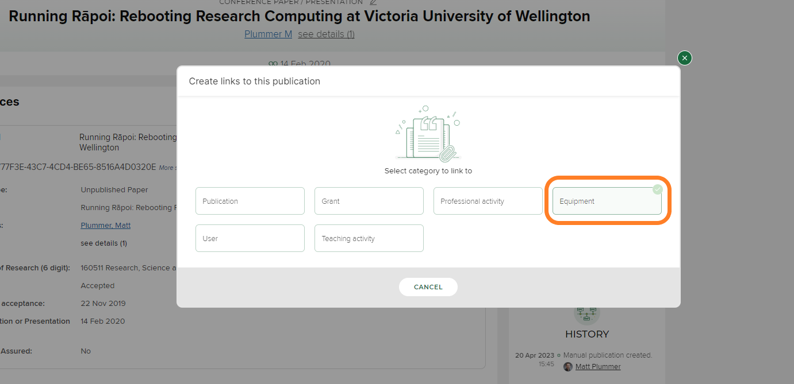
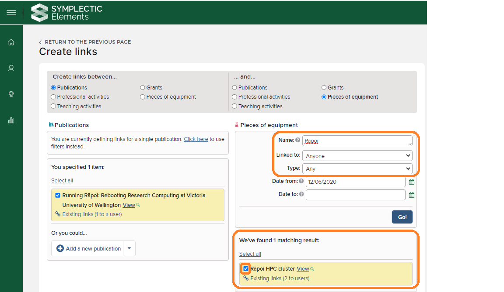
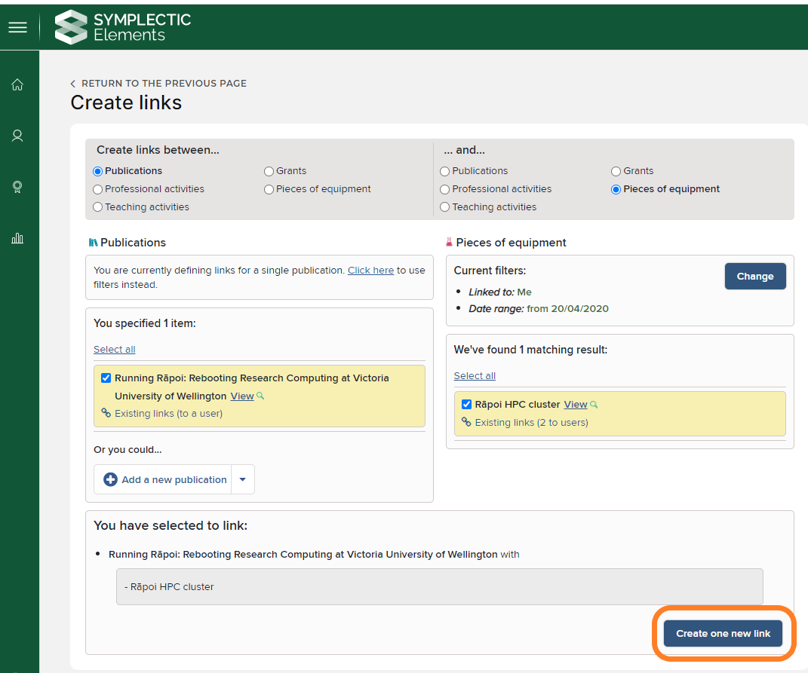
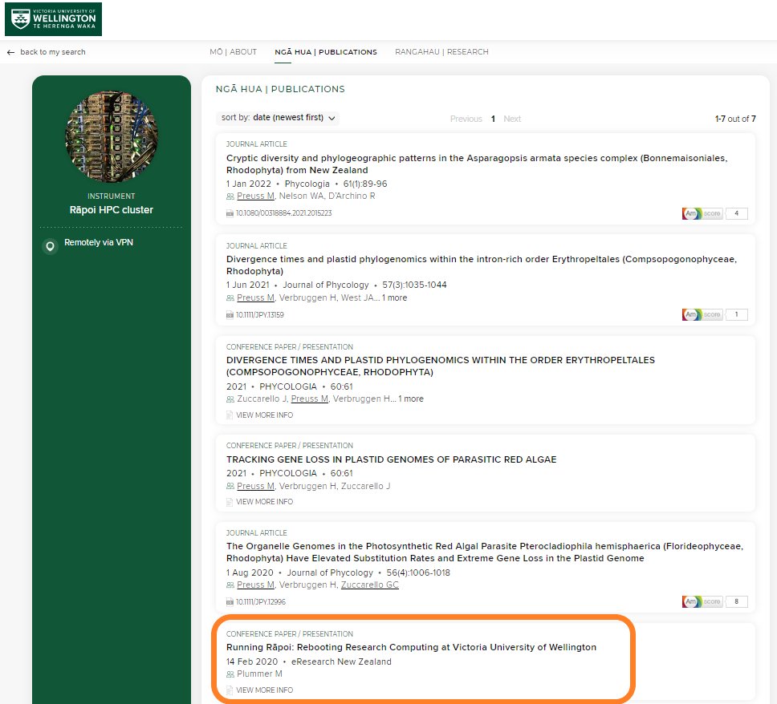

<a class="nav-link active" href="/#posts" data-target="#Posts"><span>POSTS</span></a>

**Prerequites** - to complete this process, you'll need to have an Elements profile. Elements is VUW's research management system, and all academic staff should have access by default. If you are a post-graduate student, you may not have a public profile page, but you should still be able to log in with your VUW staff credentials and carry out the process.

For full documentation on Staff Profiles with Elements, see [this page](https://intranet.wgtn.ac.nz/staff/research/using-elements/guide-staff-profiles.pdf). 


1. Log in to Elements (elements.wgtn.ac.nz) and make sure relevant research outputs (funded grant, journal article etc) are present in your Elements profile. If they are not showing, the outputs can be added manually (see [guide pdf, pp 38-39](https://intranet.wgtn.ac.nz/staff/research/using-elements/guide-staff-profiles.pdf)).

3. Navigate to output that's made use of Rāpoi (publication, grant or activity) by clicking on the ```VIEW ALL``` button at the bottom right of each card (For this example, we'll use ```Publication > VIEW ALL```):





<p>
    
    
3. Click on the relevant publication:



<p>
    
4. Click on ```RELATIONSHIPS``` - ```CREATE NEW``` on the right hand side of the interface:


<p>

5. The ```Create links to this publication``` pop-up window should appear. Select the ```Equipment``` option 




6. Type ```Rapoi``` into the ```Name``` field, and with ```Linked to``` set to Any



6. Check links are correct, then click on ```Create one new link```



<p>
    
7. Check to see your item appears on the [public Rāpoi elements profile page](https://people.wgtn.ac.nz/equipment/412229) under [publications](https://people.wgtn.ac.nz/equipment/412229/publications) or [grants](https://people.wgtn.ac.nz/equipment/412229/grants).




<p>
    
8. Repeat steps 2-7 as needed. 
    
    
    
    

    


