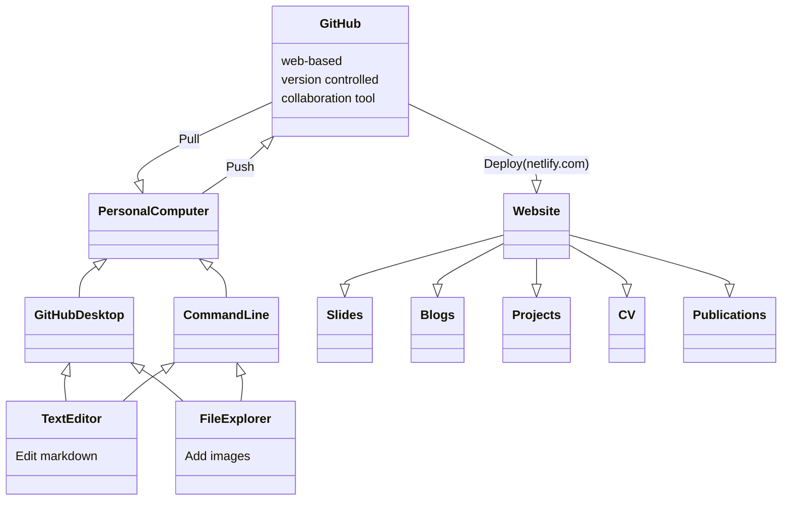

### STATIC TACTICS
#### Using static website workshops to develop capability and collaboration.
#### Matt Plummer, Victoria University of Wellington
[Academic](https://sourcethemes.com/academic/) | [Documentation](https://sourcethemes.com/academic/docs/managing-content/#create-slides)

---

## 

- Efficiently write slides in Markdown
- 3-in-1: Create, Present, and Publish your slides
- Supports speaker notes
- Mobile friendly slides

<section>
<section>
  ```mermaid
graph TD;
  A-->B;
  A-->C;
  B-->D;
  C-->D;
```
</section>
  <section>Vertical Slide 2</section>
</section>


---

## Controls

- Next: `Right Arrow` or `Space`
- Previous: `Left Arrow`
- Start: `Home`
- Finish: `End`
- Overview: `Esc`
- Speaker notes: `S`
- Fullscreen: `F`
- Zoom: `Alt + Click`
- [PDF Export](https://github.com/hakimel/reveal.js#pdf-export): `E`

---

## Concept Map

Inline code: `variable`

Code block:
```python
porridge = "blueberry"
if porridge == "blueberry":
    print("Eating...")
```

---

## Math

In-line math: $x + y = z$

Block math:

$$
f\left( x \right) = \;\frac{{2\left( {x + 4} \right)\left( {x - 4} \right)}}{{\left( {x + 4} \right)\left( {x + 1} \right)}}
$$

---

## Fragments

Make content appear incrementally

```
{} One {}
{} **Two** {}
{} Three {}
```

Press `Space` to play!

{} One {}
{} **Two** {}
{} Three {}

---

A fragment can accept two optional parameters:

- `class`: use a custom style (requires definition in custom CSS)
- `weight`: sets the order in which a fragment appears

---
```markdown
classDiagram
    GitHub --|> Personal Computer : Pull 
    GitHub <|-- Personal Computer : Push 
    Personal Computer <|-- GitHub Desktop
    Personal Computer <|-- Command Line
    GitHubDesktop <|-- TextEditor
    Command Line <|-- TextEditor
    GitHubDesktop <|-- File Explorer
    Command Line <|-- File Explorer
    

    Website --|> Slides
    Website --|> Blogs
    Website --|> Projects
    Website --|> CV
    Website --|> Publications
    GitHub : web-based
    GitHub : version controlled
    GitHub : collaboration tool
  

   GitHub --|> Website : Deploy(netlify.com)

    class Personal Computer{
    }
    class Website{
    }
    class TextEditor{
        Edit markdown
    }
    class FileExplorer{
        Add images 
    }
```markdown  

## Speaker Notes

Add speaker notes to your presentation

```markdown
{}
- Only the speaker can read these notes
- Press `S` key to view
{}
```

Press the `S` key to view the speaker notes!


- Only the speaker can read these notes
- Press `S` key to view


---

## Themes

- black: Black background, white text, blue links (default)
- white: White background, black text, blue links
- league: Gray background, white text, blue links
- beige: Beige background, dark text, brown links
- sky: Blue background, thin dark text, blue links

---

- night: Black background, thick white text, orange links
- serif: Cappuccino background, gray text, brown links
- simple: White background, black text, blue links
- solarized: Cream-colored background, dark green text, blue links

---

---

---

## Themes

- black: Black background, white text, blue links (default)
- white: White background, black text, blue links
- league: Gray background, white text, blue links
- beige: Beige background, dark text, brown links
- sky: Blue background, thin dark text, blue links

---

- night: Black background, thick white text, orange links
- serif: Cappuccino background, gray text, brown links
- simple: White background, black text, blue links
- solarized: Cream-colored background, dark green text, blue links

---



## Custom Slide

Customize the slide style and background

```markdown




```

---

## Custom CSS Example

Let's make headers navy colored.

Create `assets/css/reveal_custom.css` with:

```css
.reveal section h1,
.reveal section h2,
.reveal section h3 {
  color: navy;
}
```

---

# Questions?

[Ask](https://spectrum.chat/academic)

[Documentation](https://sourcethemes.com/academic/docs/managing-content/#create-slides)
